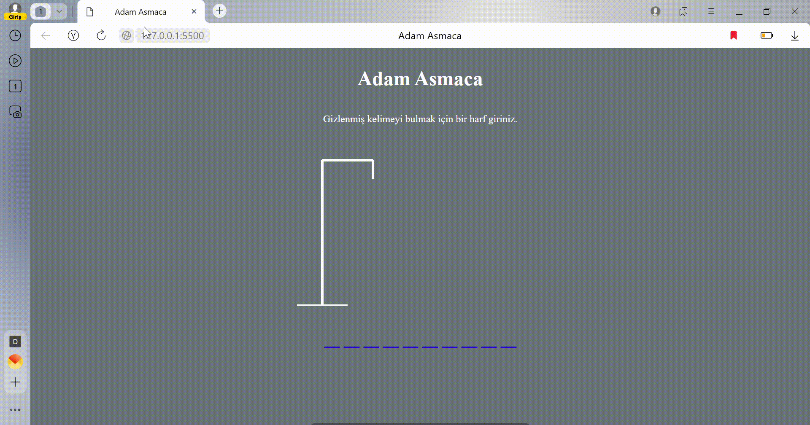

JavaScript-HangmanGame
In the Hangman project, we will first create an HTML title.
Then we will create a template.
There will be letter gaps and the correct letter will take its place.
The wrong letter will be hung in order, starting from the man's head and moving towards his feet.

Html,Css and JavaScript

# JavaScript-HangmanGame
